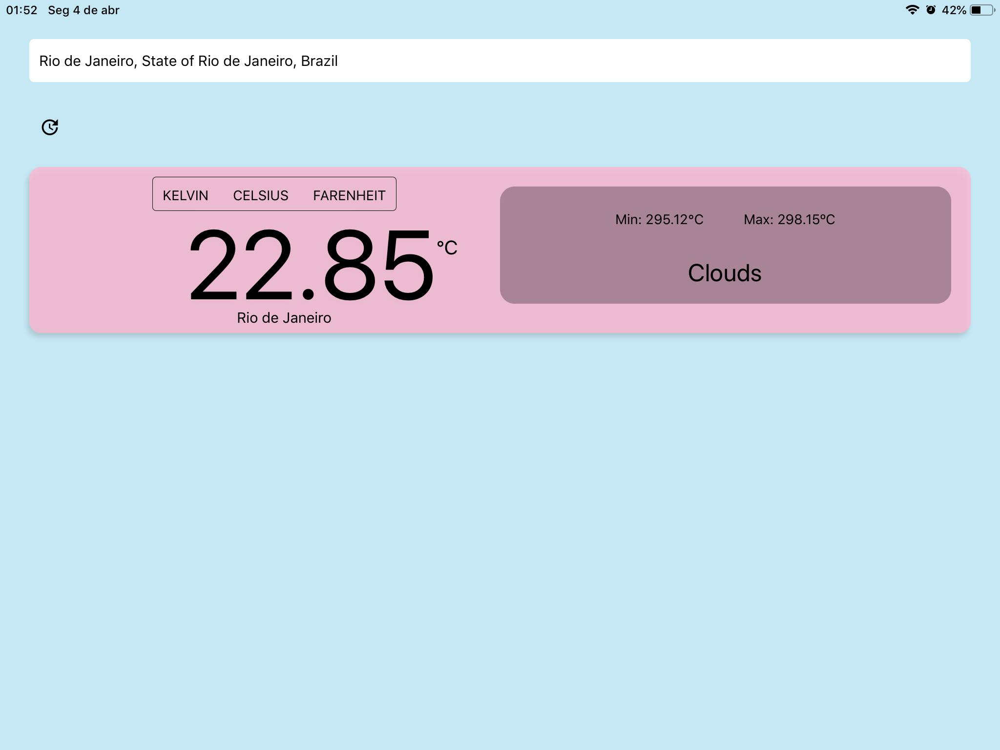
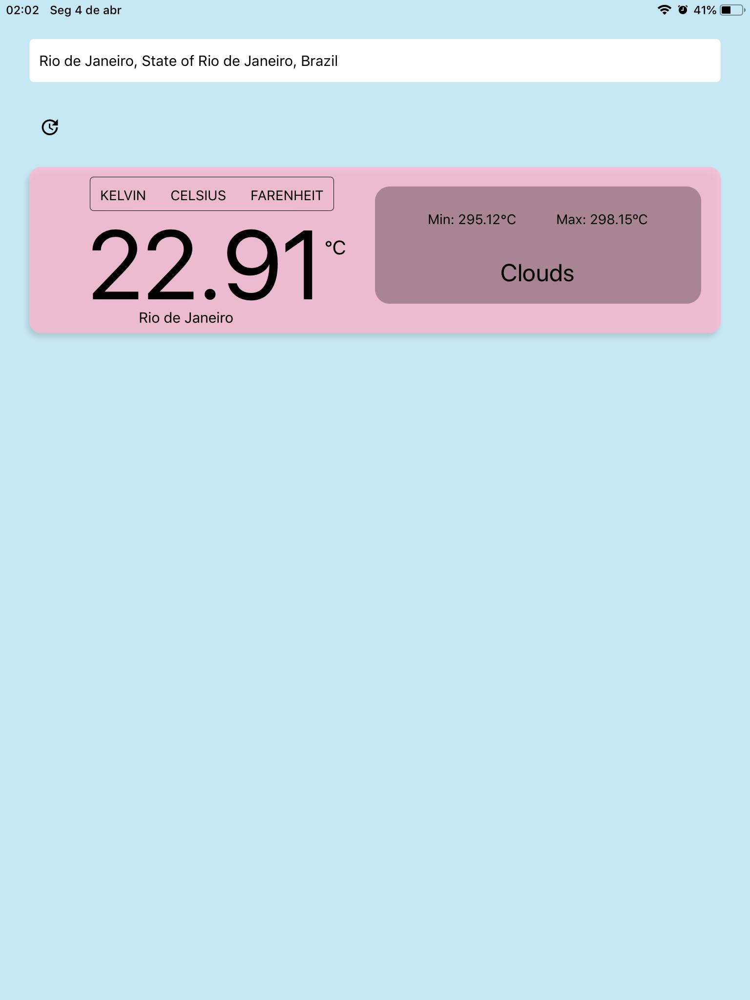

# 🏗️🚧 Under construction Weather App 🚧🏗️

## Run this App

1. Install Expo Cli ```npm install --global expo-cli```
2. Install dependencies ```yarn``` or ```npm install```
3. Set environment variables on .env file
4. Run app ```Expo start```

<br/>

## Used Technologies

- [React-Native](https://reactnative.dev/docs/getting-started)
- [TypeScript](https://www.typescriptlang.org/docs/handbook/2/basic-types.html)
- [Expo](https://docs.expo.dev/)
- [React-Native Icons](https://github.com/oblador/react-native-vector-icons)
- [Weather API](https://openweathermap.org/current)
- [AutoComplete API](https://github.com/FaridSafi/react-native-google-places-autocomplete)

<br/>

## Some Screenshots




